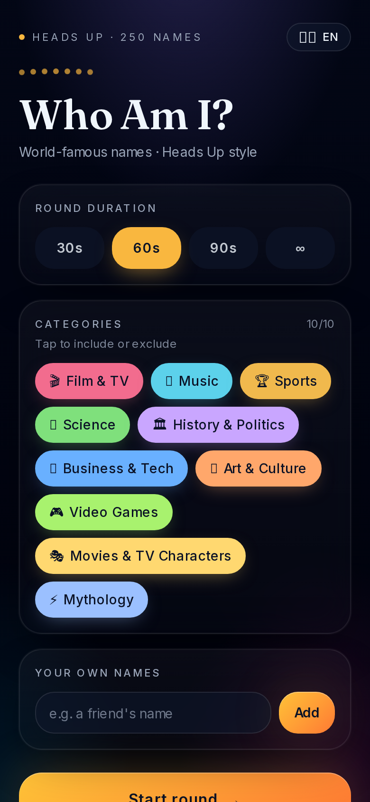
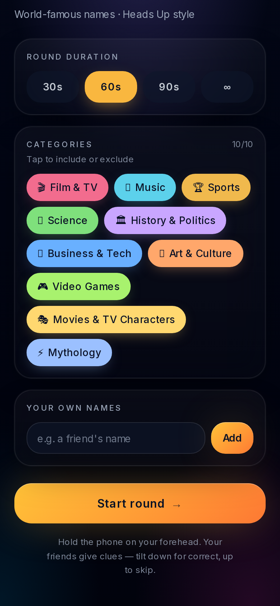
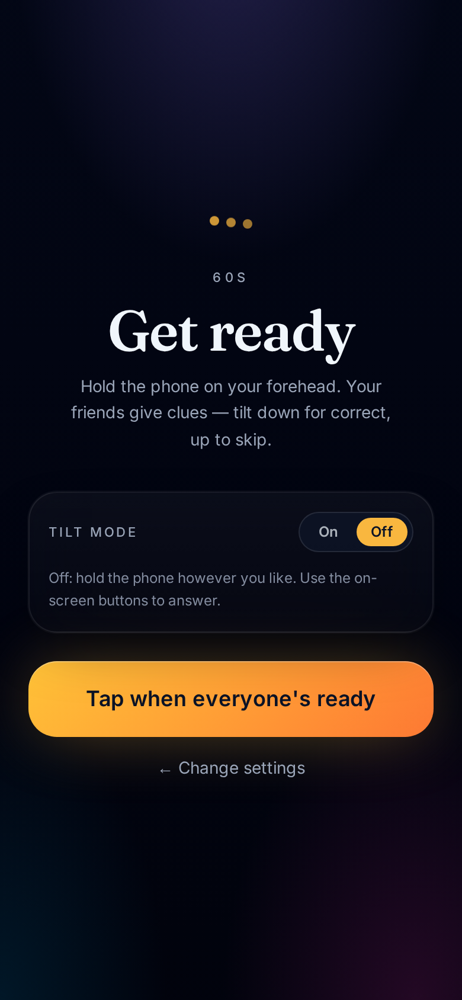
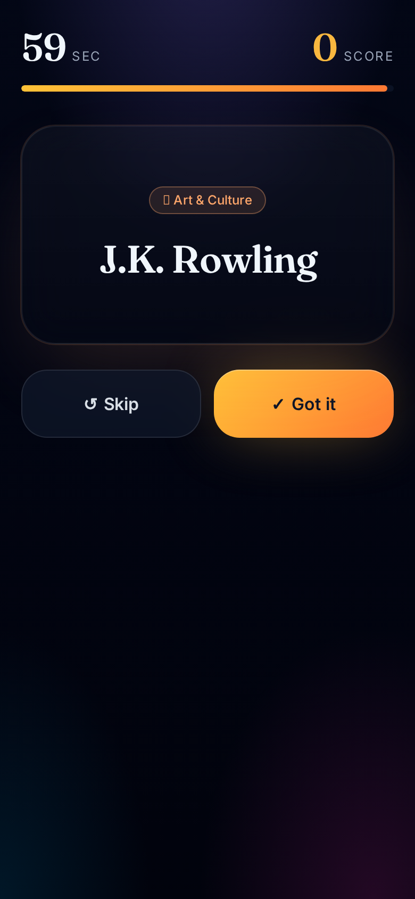

# Who Am I?

A mobile-first *Heads Up*–style party game by **GeoloApps**. Hold the phone to your forehead, your friends give clues, tilt to answer.

---


## About the game

**Who Am I?** is a fast, social guessing game for parties. One player holds the phone on their forehead so everyone else can see the name on screen. The group shouts clues, mimes, or acts things out — the player has to guess who they are before time runs out.

- 🎬 **200+ names** — actors, musicians, athletes, scientists, historical figures, fictional characters and more
- 🗂️ **10 categories** — pick and mix, or add your own custom names
- 🌍 **7 languages** — English, Ελληνικά, Français, Español, Italiano, Deutsch, Русский
- ⏱️ **Flexible rounds** — 30s, 60s, 90s or no time limit
- 📱 **Tilt to answer** — tilt down for correct, up to skip (with on-screen buttons as fallback)
- 🔒 **Runs fully on-device** — no accounts, no tracking, no network calls during play

## How to play

1. Pick your language and round length.
2. Choose one or more categories, or add your own names.
3. Choose Tilt mode on or off.
4. Tap **Start**, put the phone on your forehead, and let your friends give you clues.
5. Tilt down when you guess right, tilt up to skip.

## Screenshots

<p align="center">
  
  
  
  
  
</p>

## Tech stack


- [TanStack Start](https://tanstack.com/start) (React 19 + Vite 7)
- TypeScript
- Tailwind CSS v4
- Device Orientation & Motion APIs for tilt controls

## Development

Requires Node.js and a package manager (`bun`, `npm` or `pnpm`).

```sh
git clone <this-repository-url>
cd <repository-name>
bun install    # or: npm install
bun run dev    # or: npm run dev
```

The app runs at `http://localhost:8080`.

## License

© GeoloApps. Personal project. All third-party names are used for entertainment purposes only.
